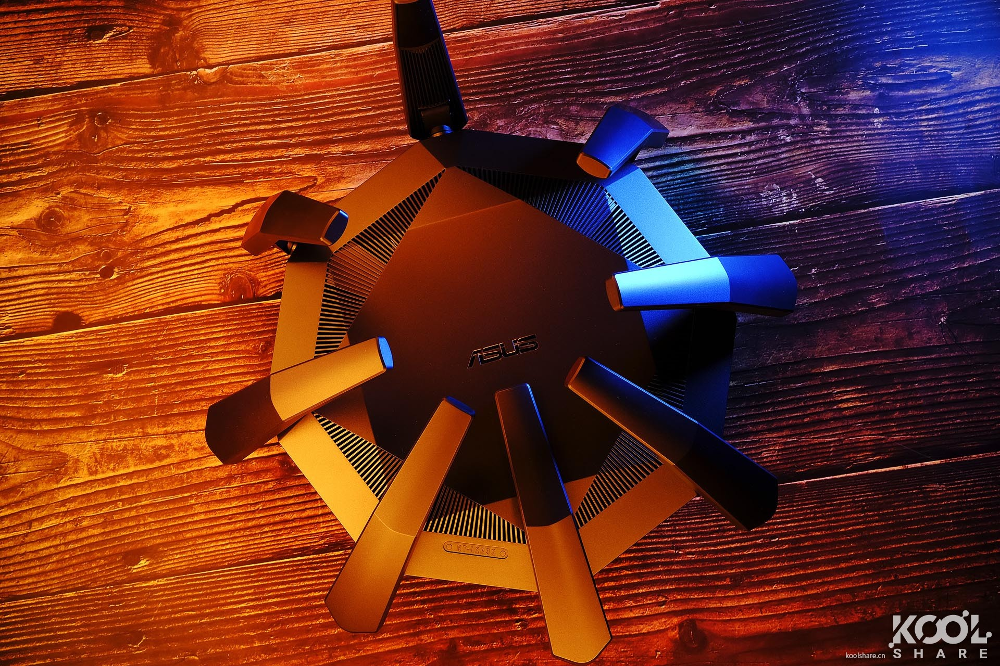
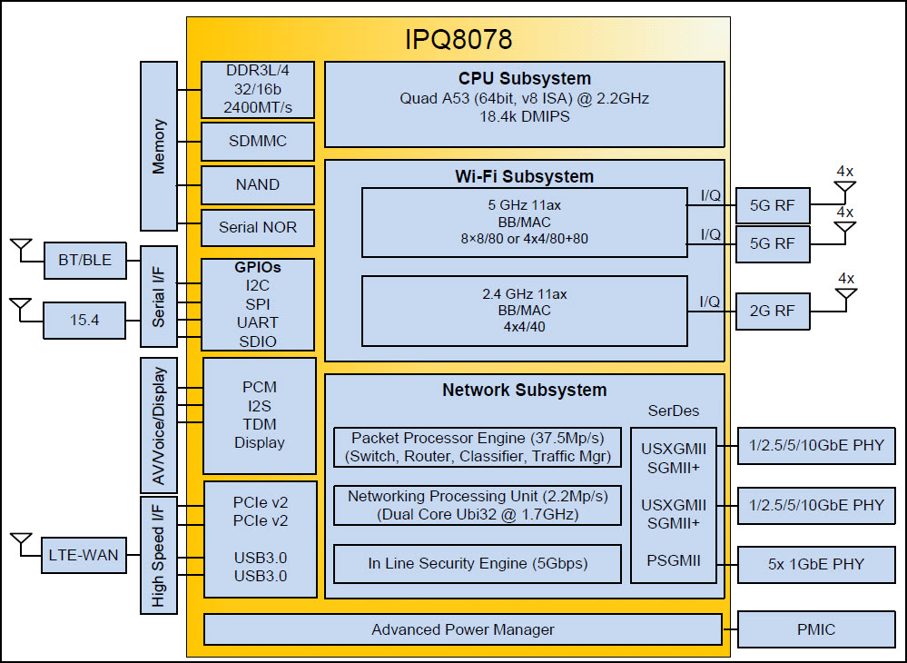
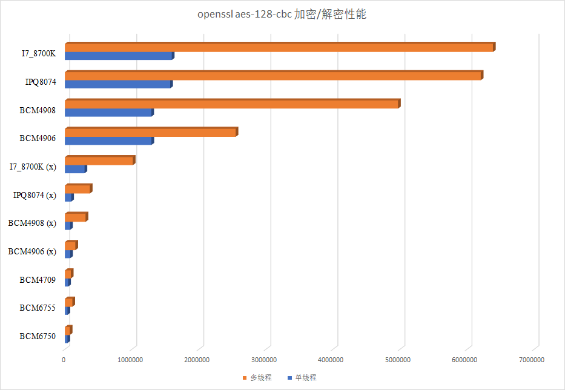
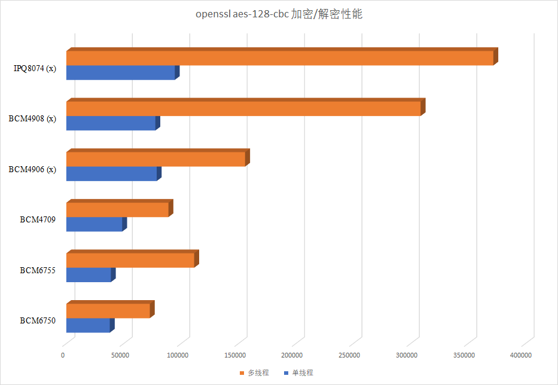
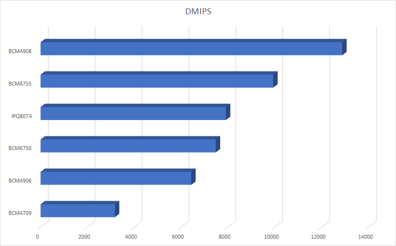

▲photo by 弹道，https://koolshare.cn/thread-173484-1-1.html

## 一、源码

> 折腾源码的时候还没收到机器，初步看看官改固件的可行性


1. **2019/11/28**，华硕放出了RT-AX89X机型的固件源代码：[GPL_RT_AX89X_300438481324.zip](https://dlsvr04.asus.com.cn/pub/ASUS/wireless/RT-AX89X/GPL_RT_AX89X_300438481324.zip)，第一时间下载下来看看。
2. 首先看了下固件内核版本，AX89X机型固件的linux内核是linux 4.4.60版本，比hnd平台4.1.27、axhnd平台4.1.51、axhnd.675x平台的4.1.52都新点。
3. 这次AX89X源码编译目录是src-qca-ipq806x，那么相应的该机型平台就定为`qca-ipq806x`了。
4. 在固件代码里，AX89X机型代码是AX89U，估计内部代号以前就是这个，后来改成AX89X？编译命令是`make RT-AX89U`
5. 固件工具链是arm-openwrt-linux-uclibcgnueabi-\*，在固件的tools目录下直接提供了压缩包，看名字显然是来自来自openwrt，相关信息：gcc version 4.6.3 20120201 (prerelease) (Linaro GCC 4.6-2012.02)。
6. 尝试编译第1次：编译没法一把过，第一次编译在shared/amas_utils.c这里出错了，提示找不到amas_path.h，查看了86U和其它固件的shared/amas_utils.c源代码，发现amas_path.h是被注释掉的。把AX89X中对应部分注释掉可以通过share的编译。这里不知道华硕是否在固件源码中删除了与AiMesh相关的代码还是有其它原因？
7. 尝试编译第2次：通过！编译完成后固件名：RT-AX89U_3.0.0.4_384_70000-ga2279e4.trx，a2279e4和我自己的commit hash挂钩。固件版本号是70000，因为还没有机器，所以不知道实际刷机后显示多少，这里不是extendno.conf中指定的81324版本，不过这与其它华硕固件源码编译出来的固件名命名规则是一样的。另外，编译出来的固件大小是固件大小48M。
8. 这次RT-AX89X固件开发SDK，其采用的是uclibc作为c库，所以这次固件体积会比华硕hnd/axhnd/axhnd,675x机型的固件小很多，运行程序时对内存占用也会少一些。
9. 以上：官改理论上可以实现，不过因为工具链的变化，软件中心很多二进制要全部重新编译，得新一个高通专用的开软件中心，现在已有` arm380软件中心 ` ` arm384软件中心 ` ` hnd/axhnd软件中心 ` `LEDE-酷软` ，再来一个，工作量有点吃不消。
10. **2019/12/30**，收到机器，简单看了下，RT-AX89X的jffs分区大小为125.3M，仍然挂载在/jffs目录，但是分区格式不是jffs2，而是ubifs，这应该是华硕第一款jffs分区采用ubifs格式。
11. **2020/03/31**，合并了华硕最新的81361代码，同样需要使用以上方法编译通过。
12. **2020/05/06**，合并了华硕最新的81377代码，跟上个版相比改动不大，同样需要使用以上方法编译通过。
13. **2020/06/04**，以81377为基础，开始RT-AX89X官改固件的制作尝试。
14. **2020/06/14**，以81377为基础，做出了第一个可用的官改固件，不过所有插件需要移植，暂时做了ROG工具箱插件的移植，其它插件以后慢慢来了。
15. **2020/09/02**，合并了华硕最新的82800代码，这次不需要修改shared/amas_utils.c，因为华硕将其删除掉了，编译一次通过。
16. **2020/09/29**，RT-AX89X稳定官改固件已经OK，软件中心除了少数插件还需要时间去移植，多数插件都能用了。

## 二、硬件/系统信息

> 2019/12/30，拿到了RT-AX89X机器，第一时间进系统瞧瞧相关信息，并简单测试下性能

### **1. SoC/CPU**

> RT-AX89X搭载的是高通IPQ8074 SoC，其应属于高通[网络芯片的Pro 1200平台](https://www.qualcomm.com/products/qualcomm-networking-pro-1200-platform)，官方名全称为：IPQ8074 Wi-Fi Access Point SoC，是集CPU、Wi-Fi、网络交换、电源管理芯片为一体的SoC，其搭载的CPU为四核 ARM Cortex A53，14 nm FinFET工艺，主频2.2GHz。

#### IPQ8074 or IPQ8078?

- 根据koolshare论坛版主`@休息下`的[**买WIFI6旗舰路由送万兆交换机，华硕RT-AX89X开箱拆解评测**](https://koolshare.cn/thread-173845-1-1.html)，RT-AX89X主板上搭载的CPU是`IPQ8074_002`

- 根据koolshare论坛版主`@夜半点灯`的[**ASUS 华硕 RT-AX89X AX6000规格 无线路由器 开箱评测拆解**](https://koolshare.cn/thread-170558-1-1.html)，来看，RT-AX89X主板上搭载的确实是高通`IPQ8074_002`Soc

- 根据华硕RT-AX89X官方页面：RT-AX89X features a top-of-the-line `2.2 GHz` quad-core CPU that is more powerful than many desktop processors.

- 根据wikidev上的信息：https://wikidevi.wi-cat.ru/ASUS_RT-AX89X，https://wikidevi.wi-cat.ru/Qualcomm，**CPU1:** **Qualcomm** IPQ8078 (**2.2 GHz**, **4 cores**)

- 根据我手上的RT-AX89X的开机dmesg信息：M**achine model: Qualcomm Technologies, Inc. IPQ807x/AP-HK01**

- 高通官方宣传的IPQ8074主频为2GHz：https://www.qualcomm.com/products/ipq8074，不过这应该是`IPQ8074_001`的主频，`IPQ8074_002`应该是工艺修复，步进提升，提高了主频到2.2GHz的版本

- [外媒测评](https://www.cgmagonline.com/reviews/asus-rt-ax89x-ax6000-dual-band-wi-fi-6-router-review/)也宣传是IPQ8078，4核心2.2GHz，SNB论坛上也有人（中国人？）提出了疑问：[What is the relationship between ipq8074,ipq8078,ipq8074_002,ipq8074A and ipq8078A](https://www.snbforums.com/threads/what-is-the-relationship-between-ipq8074-ipq8078-ipq8074_002-ipq8074a-and-ipq8078a.60352/)

#### Wi-Fi 6 ?

> 2020/09/2日更新

​		目前`IPQ8074`、`IPQ8078`现在存在两个版本：版本1和版本2，`IPQ8074_000`、`IPQ8074_002`、`IPQ8078_000`这些都属于版本1，版本1是不支持上行MU-MIMO和上行OFDMA的，在目前仅能找到的`IPQ8078`的[datasheet](https://download.siliconexpert.com/pdfs/2018/6/1/5/4/14/17/qcm_/manual/ipq-8078-0-772fcbga-mt-02-0.pdf)里也写了，该芯片仅支持下行MU-MIMO和下行OFDMA。只有名字后缀带了A的，才支持上下行MU-MIMO和上下行OFDMA，比如`IPQ8074A_000`、`IPQ8078A_000`，所以搭载了`IPQ8074A_000`的路由器，比如网件[RBK852](https://koolshare.cn/thread-172604-1-1.html)，才是完整支持WiFi 6特性的路由器。

​		那么问题来了，华硕RT-AX89X，网件RAX120都是搭载的版本1的IPQ芯片，是不支持上行MU-MIMO和上行OFDMA的！所以算是残血WiFi 6了！继续深挖的话就会发现，华硕把其全球首发WiFi 6路由器RT-AX88U送去了Wi-Fi联盟，并且通过了[Wi-Fi 6 认证](http://certifications.prod.wi-fi.org/pdf/certificate/public/download?cid=WFA91821)（2019-10-29，硬件版本1.1），同样做了Wi-Fi 6 认证的还有旗下灵耀品牌的[ZenWiFi AX6600](http://certifications.prod.wi-fi.org/pdf/certificate/public/download?cid=WFA96859)，其官网上相关产品页面打出了WiFi 6 CERTIFIED的logo。当然AX89X没有Wi-Fi 6 认证可能是华硕根本没有想给这款机型做认证，就像其旗舰产品GT-AX11000肯定是能通过Wi-Fi 6 认证的，但是华硕没送去做，但实际情况真的是这样码？

​		和RT-AX89X采用相同版本1的IPQ8074_002 SoC的网件RAX120是送了Wi-Fi联盟做了认证的，[认证结果](http://certifications.prod.wi-fi.org/pdf/certificate/public/download?cid=WFA79402)自然的，没有通过Wi-Fi 6认证。而RT-AX89X和RAX120同样使用了`IPQ8074_002`这款SoC，定然导致其Wi-Fi 6残血，不支持上行MU-MIMO和上行OFDMA，所以即使给Wi-Fi联盟去做，也根本就通不过，所以也就没必要做这个认证了。


▲RAX120


▲RT-AX89X


▲RBK852

#### 结论

- RT-AX89X上搭载的是`IPQ8074_002`无疑，可能因为其主频为2.2GHz，所以被外媒等说成了同为2.2GHz主频的`IPQ8078`。
- 至于`IPQ8074_002`和`IPQ8078`有什么区别，这就不得而知了，因为高通现在已经不公开放出其IPQ芯片的datasheet了。
- 因高通芯片`IPQ8074_002`的原因，RT-AX89X并不支持Wi-Fi 6的全部技术特性：不支持上行MU-MIMO和上行OFDMA，所以算是残血Wi-Fi6了。



▲目前能找到`IPQ8078`的[datasheet](https://download.siliconexpert.com/pdfs/2018/6/1/5/4/14/17/qcm_/manual/ipq-8078-0-772fcbga-mt-02-0.pdf)里的芯片架构图，可以为`IPQ8074`做一定的参考。

#### CPU信息

在RT-AX89X固件后台，运行`cat /proc/cpuinfo`信息显示如下（只截取了一个核心的信息）

```bash
admin@RT-AX89X:/tmp/home/root# cat /proc/cpuinfo 
processor	: 0
model name	: ARMv7 Processor rev 4 (v7l)
BogoMIPS	: 23.66
Features	: half thumb fastmult vfp edsp neon vfpv3 tls vfpv4 idiva idivt vfpd32 lpae evtstrm aes pmull sha1 sha2 crc32 
CPU implementer	: 0x41
CPU architecture: 7
CPU variant	: 0x0
CPU part	: 0xd03
CPU revision	: 4
```

虽然`IPQ8074 SoC`在CPU部分是四核 ARM Cortex A53，而A53应该是armv8架构的，但是系统内却表明这是armv7架构，运行`uname -a`命令同样显示的armv7l。

高通官方表明这是一颗支持64位的V8芯片：`The CPU subsystem consists of quad ARM Cortex A53s @ 2.2 GHz, with 64 bit ISA v8 instruction set.` 说明确确实实是支持v8指令集的CPU。

找了下原因，这是因为RT-AX89X的固件内核是32位的，所以其固件内显示armv7l，这活生生一个armv8架构的CPU，被封印成了armv7。

这一点不像博通BCM490x系列的SDK，博通在为BCM490x提供的SDK中，提供的是64位的linux内核。不过固件里用户空间程序还是32位的，但是这挡不住搭载了BCM490x的机器可以运行64位程序啊。

> 高通IPQ8074 soc搭载的CPU，与armv8架构的4核心博通BCM4908 28nm 1.8GHz，还有老一代如RT-AC5300搭载的armv7架构的2核心博通BCM4709 40nm 1.4GHz处理器，再加上armv7架构的3核心博通BCM6750 1.5GHz进行如下比较。

**高通IPQ8074支持指令集：**`half thumb fastmult vfp edsp neon vfpv3 tls vfpv4 idiva idivt vfpd32 lpae evtstrm aes pmull sha1 sha2 crc32`

**博通BCM4908支持指令集：**`fp asimd evtstrm aes pmull sha1 sha2 crc32`。

**博通BCM6750支持指令集：**`half thumb fastmult vfp edsp neon vfpv3 tls vfpv4 idiva idivt vfpd32 lpae`。

**博通BCM4709支持指令集：**`swp half thumb fastmult edsp`。

- IPQ8074和[BCM6750](https://www.broadcom.com/products/wireless/wireless-lan-infrastructure/bcm6750)均为SoC，他们都集成了CPU、Wi-Fi芯片、网络交换芯片等模块，所以支持的指令集自然要多一些，相较于博通的BCM6750，IPQ8074显然在CPU部分上面更加给力，多支持了`evtstrm aes pmull sha1 sha2 crc32`这些硬件加速支持，并且主频还更高。
- [BCM4908](https://www.broadcom.com/products/wireless/wireless-lan-infrastructure/bcm49408)和[BCM4709](https://www.broadcom.com/site-search?q=BCM4709)则主要是纯CPU，没有Wi-Fi芯片支持，不过有交换机支持，且前者支持2.5G口，不过可惜只支持一个！BCM4908为armv8架构，支持64位应用；BCM4709为armv7架构，仅支持32位应用。
- 对于加密/校验算法，IPQ8074和BCM4908都支持aes等加密/解密算法指令集，在某些用到特定加密/解密的应用中，可以得到相当大的提升，具体可以看后文跑分部分的测试。

#### 高通 or 博通？

对于高通和博通的华硕路由器，梅林固件的开发者对高通芯片在路由器上的发展是相当看好，梅林固件开发者说到：

> Qualcomm is ahead of Broadcom in various areas. Faster CPU, cleaner software stack as well. Broadcom has a lot of kernel hacks left and right within their software stack, which is not helping keeping the software up to date..
>
> Asus has been using chips from all the major players already (Qualcomm, Broadcom and Mediatek), depending on where they want to place a given product within their product range. So this isn't their first QCA product, however this is the first time they use it for ta high-end model. They are already using QCA for their Lyra products, for instance.
>
> Personally, I have a feeling that Broadcom might gradually get pushed to the bottom of the market, with QCA being dominating these days in the ARM SoC market.
>
> 高通在很多领域都领先博通，如更快的CPU、更干净的软件包。博通软件里有太多对linux内核的魔改，这导致他们的软件无法得到及时的更新。
>
> 华硕已经使用过各大主流厂商的芯片，比如高通、博通、联发科等，这取决于华硕对产品的定位。所以这并不是第一次华硕使用高通的产品，但是这确实是第一次华硕在高端型号中使用高通的产品，之前使用高通的芯片有织女星Lyra。
>
> 个人认为博通可能会逐渐被挤到路由器市场的底层，而由高通在ARM SoC市场上主宰。

> By cleaner, I mean it's not the complete mess that Broadcom's is. Broadcom's SDK has extensive patches applied to the kernel and busybox, and their HND build environment filesystem is a complete maze to navigate. Combined with Asus's own build environment, I still haven't figured out why building an HND firmware requires many of the userspace tools to be recompiled 3 or even 4 times... It takes me 21 minutes to build the RT-AC88U, versus a bit over 30 minutes for the RT-AX88U.
>
> 我说软件包更干净，并不是说博通就是一团糟。博通的SDK大规模的对内核和busybox进行了修改，而且HND机型的编译环境简直就像迷宫一样复杂。和华硕自己的编译环境结合起来，我到现在都没有搞明白为什么编译HND机型的固件需要一些用户空间的工具被反复编译3次甚至4次... 我编译RT-AC88U只需要21分钟，编译RT-AX88U却需要超过30分钟。

高通目前从低端的`Networking Pro 400 Platform`一直到`Networking Pro 1200 Platform`，并且也扩充了其WiFi 6E的平台，比如低端的Pro 610，高端的[Pro 1610](https://www.qualcomm.com/products/qualcomm-networking-pro-1610-platform)系列，其高端的Pro 1610已经不是残血Wi-Fi 6，其支持Wi-Fi 6/6E，支持2.4、5、和6GHz 总共16条空间流并发，并且其160MHz频宽特性得到了完整支持。所以高通以其低中高价位全方位覆盖了WiFi芯片，所以大家既能看到小米AX1800、AX3600这些性价比高的路由，也能看到比如网件RBK852这种全高通方案的高端mesh路由（当然网件本身死贵死贵的也有原因）。

而博通近期亮相的Wi-Fi芯片只有BCM6750、BCM6755、BCM43684等，其SoC的CPU性能，因没有aes等加速指令集，性能上都弱了高通一截。虽然有博通BCM4908这种旗舰，但是其是作为单独的CPU，而且28nm的制程也明显弱于高通的14nm 。所以，在看不到任何迹象博通会推出新的SoC/CPU之前，高通这边确实有比较好的未来发展。

不过好在博通这边对Wi-Fi 6的支持较早，而且其一开始就是全部特性的支持，并且近期使用较多的BCM6750、BCM6755是有Wi-Fi 6E支持的；而高通推出的`IPQ807x SoC`在版本1中竟然不支持完整的Wi-Fi 6特性。所以当我们回到当下RT-AX89X、RAX120这些机器，可以说虽然高通很强，未来可能更强，但是搭载了第一代高通IPQ系列SoC的RT-AX89X这款机器却成了炮灰了，当然，炮灰还有网件，RAX120等。

不少人对RT-AX89X大吹特吹，地球最强路由的字眼都用出来了，只要看到高通就盲目的吹。但是必须实事求是的说，RT-AX89X虽然强，但是也有缺陷，其Wi-Fi 6因不支持上行MU-MIMO和上行OFDMA，成为残血Wi-Fi 6就不说了！160MHz，是Wi-Fi 6的另一个重要特性，而这个特性因RT-AX89X上搭载的高通Wi-Fi芯片，也输给了博通。简单的说，博通只需要单颗Wi-Fi芯片（BCM43684）就能实现完整160MHz频宽的支持，而高通却需要两颗（2 * QCN5054），用80 + 80的方式来实现160MHz频宽的支持。

总之，因为高通第一代的Wi-Fi 6高端芯片的缺陷（不支持上行MU-MIMO和上行OFDMA + 拼接160MHz），导致搭载了这些芯片的机器RT-AX89X成为了炮灰，所以RT-AX89X并没有被吹嘘的那么流弊。

### 2. 无线芯片

> AX89X的5G方案是QCN5054，2G方案是QCN5024

#### 5G

芯片方案为高通QCN5054, 一个QCN5054可以负责 80MHz 频宽下的 4个5GHz空间流，2个组合在一起可以实现8个空间流 80MHz ，或者4个空间流160MHz，所以其160Mhz是两个QCN5054 80 + 80的方法实现的。

- 天线配置：8x8/8s-80MHz or 4x4/4s-80+80MHz
- AX模式：4800 Mbps (5 GHz)
- AC模式：3466 Mbps (5 GHz)

#### 2.4G

芯片方案为QCN5024，2.4GHz无线网络芯片提供802.11ax 4个空间流

- 天线配置：4x4/4s-40MHz
- AX模式：1150 Mbps (2.4 GHz)
- AC模式：800 Mbps (2.4 GHz)

参考1：https://www.10bests.com/wifi6-routers-by-chip-broadcom/

参考2：https://www.10bests.com/wifi6-routers-by-chip-qualcomm/

### 3. 功率调节

> RT-AX89X采用高通方案，所以不能使用博通的wl程序来进行调节了，高通使用的是iw，在网络上也能找到一些方法教程

#### mac

值得注意的是，RT-AX89X的wifi 接口名：`5G为ath0`，`2.4G为ath1`，分别为设备`wifi0`和设备`wifi1`，所以在查询网卡功率和温度的时候应该注意0和1的数字顺序。

```bash
# 查看2.4G mac地址，wl0，wifi1
admin@RT-AX89X:/tmp/home/root# nvram get wl0_hwaddr
A8:5E:45:95:E0:68

admin@RT-AX89X:/tmp/home/root# cat /proc/wifi1/ic_config|grep addr
ic_my_hwaddr: a8:5e:45:95:e0:68
ic_myaddr: a8:5e:45:95:e0:68

# 查看5G mac地址，wl1，wifi0
admin@RT-AX89X:/tmp/home/root# nvram get wl1_hwaddr
A8:5E:45:95:E0:6C

admin@RT-AX89X:/tmp/home/root# cat /proc/wifi0/ic_config|grep addr
ic_my_hwaddr: a8:5e:45:95:e0:6c
ic_myaddr: a8:5e:45:95:e0:6c
```

#### iw

```bash
# 使用iw 查询wifi区域，澳大利亚，亚洲，默认
admin@RT-AX89X:/tmp/home/root# iw reg get
global
country 00: DFS-UNSET
	(2402 - 2472 @ 40), (N/A, 20), (N/A)
	(2457 - 2482 @ 20), (N/A, 20), (N/A), AUTO-BW, PASSIVE-SCAN
	(2474 - 2494 @ 20), (N/A, 20), (N/A), NO-OFDM, PASSIVE-SCAN
	(5170 - 5250 @ 80), (N/A, 20), (N/A), AUTO-BW, PASSIVE-SCAN
	(5250 - 5330 @ 80), (N/A, 20), (0 ms), DFS, AUTO-BW, PASSIVE-SCAN
	(5490 - 5730 @ 160), (N/A, 20), (0 ms), DFS, PASSIVE-SCAN
	(5735 - 5835 @ 80), (N/A, 20), (N/A), PASSIVE-SCAN
	(57240 - 63720 @ 2160), (N/A, 0), (N/A)

# 使用iw 设置区域为BZ
admin@RT-AX89X:/tmp/home/root# iw reg set BZ
admin@RT-AX89X:/tmp/home/root# iw reg get
global
country BZ: DFS-JP
	(2402 - 2482 @ 40), (N/A, 30), (N/A)
	(5735 - 5835 @ 80), (N/A, 30), (N/A)

# 使用iw 设置区域为00
admin@RT-AX89X:/tmp/home/root# iw reg set 00
admin@RT-AX89X:/tmp/home/root# iw reg get
global
country 00: DFS-UNSET
	(2402 - 2472 @ 40), (N/A, 20), (N/A)
	(2457 - 2482 @ 20), (N/A, 20), (N/A), AUTO-BW, PASSIVE-SCAN
	(2474 - 2494 @ 20), (N/A, 20), (N/A), NO-OFDM, PASSIVE-SCAN
	(5170 - 5250 @ 80), (N/A, 20), (N/A), AUTO-BW, PASSIVE-SCAN
	(5250 - 5330 @ 80), (N/A, 20), (0 ms), DFS, AUTO-BW, PASSIVE-SCAN
	(5490 - 5730 @ 160), (N/A, 20), (0 ms), DFS, PASSIVE-SCAN
	(5735 - 5835 @ 80), (N/A, 20), (N/A), PASSIVE-SCAN
	(57240 - 63720 @ 2160), (N/A, 0), (N/A)
```

#### iwconfig

```shell
# 使用iwconfig查询2G信息，澳大利亚，亚洲（149信道）
admin@RT-AX89X:/tmp/home/root# iwconfig ath1
ath1      IEEE 802.11axg  ESSID:"宇宙引力波天线亚洲站"  
          Mode:Master  Frequency:2.462 GHz  Access Point: A8:5E:45:95:E0:68   
          Bit Rate:573.5 Mb/s   Tx-Power:30 dBm   
          RTS thr:off   Fragment thr:off
          Encryption key:2685-98DE-4413-01F7-93DC-8851-7B98-1682   Security mode:restricted
          Power Management:off
          Link Quality=53/94  Signal level=-86 dBm  Noise level=-106 dBm
          Rx invalid nwid:133  Rx invalid crypt:0  Rx invalid frag:0
          Tx excessive retries:0  Invalid misc:0   Missed beacon:0
          
# 使用iwconfig查询5G信息，澳大利亚，亚洲（149信道）
admin@RT-AX89X:/tmp/home/root# iwconfig ath0
ath0      IEEE 802.11axa  ESSID:"ASUS_68_5G"  
          Mode:Master  Frequency:5.745 GHz  Access Point: A8:5E:45:95:E0:6C   
          Bit Rate:4.8039 Gb/s   Tx-Power:30 dBm   
          RTS thr:off   Fragment thr:off
          Encryption key:02B6-DA11-BA9C-52E6-4933-FE90-86BD-D450   Security mode:restricted
          Power Management:off
          Link Quality=50/94  Signal level=-87 dBm  Noise level=-106 dBm
          Rx invalid nwid:9  Rx invalid crypt:0  Rx invalid frag:0
          Tx excessive retries:0  Invalid misc:0   Missed beacon:0
```

#### iwlist

```bash
#查询2G功率，默认区域
admin@RT-AX89X:/# iwlist ath1 txpower
ath1      8 available transmit-powers :
	  0 dBm  	(1 mW)
	  6 dBm  	(3 mW)
	  10 dBm  	(10 mW)
	  14 dBm  	(25 mW)
	  18 dBm  	(63 mW)
	  22 dBm  	(158 mW)
	  26 dBm  	(398 mW)
	  30 dBm  	(1000 mW)
          Current Tx-Power:30 dBm  	(1000 mW)

# 查询5G功率，澳大利亚
admin@RT-AX89X:/# iwlist ath0 txpower
ath0      8 available transmit-powers :
	  0 dBm  	(1 mW)
	  6 dBm  	(3 mW)
	  10 dBm  	(10 mW)
	  14 dBm  	(25 mW)
	  18 dBm  	(63 mW)
	  22 dBm  	(158 mW)
	  26 dBm  	(398 mW)
	  30 dBm  	(1000 mW)
          Current Tx-Power:30 dBm  	(1000 mW)

# 2G信道支持
ath1      88 channels in total; available frequencies :
          Channel 01 : 2.412 GHz
          Channel 02 : 2.417 GHz
          Channel 03 : 2.422 GHz
          Channel 04 : 2.427 GHz
          Channel 05 : 2.432 GHz
          Channel 06 : 2.437 GHz
          Channel 07 : 2.442 GHz
          Channel 08 : 2.447 GHz
          Channel 09 : 2.452 GHz
          Channel 10 : 2.457 GHz
          Channel 11 : 2.462 GHz
          Channel 12 : 2.467 GHz
          Channel 13 : 2.472 GHz
          Current Frequency:2.462 GHz (Channel 11)
          
# 5G信道支持
ath0      160 channels in total; available frequencies :
          Channel 36 : 5.18 GHz
          Channel 40 : 5.2 GHz
          Channel 44 : 5.22 GHz
          Channel 48 : 5.24 GHz
          Channel 52 : 5.26 GHz
          Channel 56 : 5.28 GHz
          Channel 60 : 5.3 GHz
          Channel 64 : 5.32 GHz
          Channel 149 : 5.745 GHz
          Channel 153 : 5.765 GHz
          Channel 157 : 5.785 GHz
          Channel 161 : 5.805 GHz
          Channel 165 : 5.825 GHz
          Current Frequency:5.18 GHz (Channel 36)

# 5G其它AP(RT-AX88U 5G)
admin@RT-AX89X:/# iwlist ath0 peers
ath0      Peers/Access-Points in range:
    0C:9D:92:02:1B:2C : Quality=94/94  Signal level=-6 dBm  Noise level=-95 dBm

# 扫描
admin@RT-AX89X:/# iwlist ath0 scanning

# 扫描特定AP(RT-AX88U 5G)
admin@RT-AX89X:/# iwlist ath0 scanning|grep -A 15 -B1 "ASUS"
Cell 10 - Address: 0C:9D:92:02:1B:2C
          ESSID:"ASUS_28_5G"
          Mode:Master
          Frequency:5.18 GHz (Channel 36)
          Quality=94/94  Signal level=-6 dBm  Noise level=-95 dBm
          Encryption key:on
          Bit Rates:6 Mb/s; 9 Mb/s; 12 Mb/s; 18 Mb/s; 24 Mb/s
                    36 Mb/s; 48 Mb/s; 54 Mb/s
          Extra:bcn_int=100
          IE: IEEE 802.11i/WPA2 Version 1
              Group Cipher : CCMP
              Pairwise Ciphers (1) : CCMP
              Authentication Suites (1) : PSK
          Extra:wme_ie=dd180050f2020101840003a4000027a4000042435e0062322f00
          Extra:phy_mode=IEEE80211_MODE_11AXA_HE160
          Extra:dtim_period=1
          IE: Unknown: DD1D0050F204104A0001101044000102103C0001031049000600372A000120

# 扫描特定AP(RT-AX88U 2G)
admin@RT-AX89X:/# iwlist ath0 scanning|grep -A 17 -B1 "ASUS"
Cell 27 - Address: 0C:9D:92:02:1B:28
          ESSID:"ASUS_28_2G"
          Mode:Master
          Frequency:2.417 GHz (Channel 2)
          Quality=94/94  Signal level=-10 dBm  Noise level=-95 dBm
          Encryption key:on
          Bit Rates:1 Mb/s; 2 Mb/s; 5.5 Mb/s; 11 Mb/s; 18 Mb/s
                    24 Mb/s; 36 Mb/s; 54 Mb/s; 6 Mb/s; 9 Mb/s
                    12 Mb/s; 48 Mb/s
          Extra:bcn_int=1iwlist ath1 scanning|grep -A 15 -B1 "ASUS"      00
          IE: IEEE 802.11i/WPA2 Version 1
              Group Cipher : CCMP
              Pairwise Ciphers (1) : CCMP
              Authentication Suites (1) : PSK
          Extra:wme_ie=dd180050f2020101840003a4000027a4000042435e0062322f00
          Extra:phy_mode=IEEE80211_MODE_11AXG_HE20
          Extra:dtim_period=1
          IE: Unknown: DD1D0050F204104A0001101044000102103C0001031049000600372A000120
          Extra:aimesh=dd25f832e401010102010003143ba69b45b21745f913ae39e5c51c680c5aed3b9307045aed3b93
                    
                   
```

#### 修改功率

实际测试发现在默认区域中国下，wifi功率是没法调节升高的，但是在澳大利亚和亚洲可以调节降低

```bash
ip link set ath1 down
iwconfig ath1 txpower 1000mw
ip link set ath1 up
iwconfig ath1

# 修改2G功率
ip link set ath1 down
iw dev wifi1 set txpower fixed 30mBm
ip link set ath1 up

# 修改5G功率
ip link set wifi0 down
iw dev wifi0 set txpower fixed 30mBm
ip link set wifi0 up

iwconfig ath0 txpower 30dbm
```

- 经过测试，发现澳大利亚和亚洲均为30dbm的发射功率，不过亚洲地区是全信道，澳大利亚的信达和默认值一样。
- iw reg get的结果表明不论在什么区域下，都是处于`country 00: DFS-UNSET`的状态，难道AX89X不受DFS的限制？
- 亚洲地区5G选149信道功率为30dbm，选36信道则为23dbm
- 澳大利亚地区不管是36信道还是149信道，都能达到30dbm的功率


参考（iw）：https://miloserdov.org/?p=337

参考：https://git.kernel.org/pub/scm/linux/kernel/git/sforshee/wireless-regdb.git/tree/db.txt

参考（iwconfig）：https://forums.kali.org/showthread.php?4129-Increase-Wi-Fi-TX-Power-Signal-Strength

### 4. 系统信息

#### 磁盘信息

```bash
admin@RT-AX89X:/tmp/home/root# df -h
Filesystem                Size      Used Available Use% Mounted on
/dev/root                45.1M     45.1M         0 100% /
devtmpfs                436.7M      4.0K    436.7M   0% /dev
tmpfs                   436.9M      4.6M    432.3M   1% /tmp
/dev/ubi0_5             125.4M    132.0K    125.3M   0% /jffs

admin@RT-AX89X-E068:/sys/devices/virtual/ubi/ubi0# cat /proc/mtd
dev:    size   erasesize  name
mtd0: 003e0000 00020000 "Bootloader"
mtd1: 0fc00000 00020000 "UBI_DEV"
mtd2: 0005d000 0001f000 "nvram"
mtd3: 0005d000 0001f000 "Factory"
mtd4: 0005d000 0001f000 "Factory2"
mtd5: 06406000 0001f000 "linux"
mtd6: 0612418c 0001f000 "rootfs"

ORDER	NAME			UBI			TYPE	SIZE			OFFSET
mtd0	Bootloader					nand	3.875 MB		0 MB
mtd1	UBI_DEV						nand	252 MB			4 MB
mtd2	nvram			ubi0_0		ubi		0.363281 MB
mtd3	Factory			ubi0_1		ubi		0.363281 MB
mtd4	Factory2		ubi0_2		ubi		0.363281 MB
mtd5	linux			ubi0_3		ubi		100.023 MB
mtd6	rootfs			ubi0_5		ubi		97.141 MB

```

#### 分区信息

```bash
admin@RT-AX89X-E068:/tmp/home/root# ubinfo /dev/ubi0 -a
ubi0
Volumes count:                           5
Logical eraseblock size:                 126976 bytes, 124.0 KiB
Total amount of logical eraseblocks:     2016 (255983616 bytes, 244.1 MiB)
Amount of available logical eraseblocks: 0 (0 bytes)
Maximum count of volumes                 128
Count of bad physical eraseblocks:       0
Count of reserved physical eraseblocks:  40
Current maximum erase counter value:     156
Minimum input/output unit size:          2048 bytes
Character device major/minor:            242:0
Present volumes:                         0, 1, 2, 3, 5

Volume ID:   0 (on ubi0)
Type:        dynamic
Alignment:   1
Size:        3 LEBs (380928 bytes, 372.0 KiB)
State:       OK
Name:        nvram
Character device major/minor: 242:1
-----------------------------------
Volume ID:   1 (on ubi0)
Type:        dynamic
Alignment:   1
Size:        3 LEBs (380928 bytes, 372.0 KiB)
State:       OK
Name:        Factory
Character device major/minor: 242:2
-----------------------------------
Volume ID:   2 (on ubi0)
Type:        dynamic
Alignment:   1
Size:        3 LEBs (380928 bytes, 372.0 KiB)
State:       OK
Name:        Factory2
Character device major/minor: 242:3
-----------------------------------
Volume ID:   3 (on ubi0)
Type:        dynamic
Alignment:   1
Size:        826 LEBs (104882176 bytes, 100.0 MiB)
State:       OK
Name:        linux
Character device major/minor: 242:4
-----------------------------------
-----------------------------------
Volume ID:   5 (on ubi0)
Type:        dynamic
Alignment:   1
Size:        1137 LEBs (144371712 bytes, 137.7 MiB)
State:       OK
Name:        jffs2
Character device major/minor: 242:6
```


```bash
mkdir /mnt/nvram
mount -t ubifs ubi0_0 /mnt/nvram

mkdir /mnt/Factory
mount -t ubifs ubi0:Factory /mnt/Factory

mkdir /mnt/nvram
mount -t ubifs ubi0:nvram /mnt/nvram

mkdir /mnt/nvram
mount -t ubifs ubi0:nvram /mnt/nvram

mkdir /mnt/nvram
mount -t ubifs ubi0:nvram /mnt/nvram
```


```bash
# 读取nvram
xxd -s 0x0003701c -l 36107 /dev/mtd2

$ xxd -p -u -s 0x0003701c -l 36107 /dev/mtd2|tr -d '\n'|sed 's/.\{2\}/& /g'|sed 's/00 /0A /g'|xxd -p -r >nvram-mtd2.txt

$ xxd -p -u -s 0x0003701c -l 36835 /dev/mtd2|tr -d '\n'|sed 's/.\{2\}/& /g'|sed 's/00 /0A /g'|xxd -p -r | sed '/^$/d'>nvram-mtd2.txt

$ nvram show >nvram-show.txt
```


#### 系统信息

```bash
admin@RT-AX89X:/tmp/home/root# uname -a
Linux RT-AX89X 4.4.60 #1 SMP PREEMPT Tue Sep 24 17:29:21 CST 2019 armv7l ASUSWRT
```

```bash
admin@RT-AX89X:/jffs/.koolshare/bin# cat /proc/version 
Linux version 4.4.60 (root@asus) (gcc version 4.6.3 20120201 (prerelease) (Linaro GCC 4.6-2012.02) ) #1 SMP PREEMPT Mon Jul 6 19:56:25 CST 2020
```

#### CPU温度

```bash
admin@RT-AX89X:/jffs/.koolshare/bin# cat /sys/class/thermal/thermal_zone0/temp
52
```

#### 网卡温度

```bash
# 2G网卡温度
admin@RT-AX89X:/tmp/home/root# thermaltool -i wifi1 -get|sed -n 's/.*temperature: \([0-9][0-9]\).*/\1/p'
59

# 5G网卡温度
admin@RT-AX89X:/tmp/home/root# thermaltool -i wifi0 -get|sed -n 's/.*temperature: \([0-9][0-9]\).*/\1/p'
60
```

#### 网卡功率

```bash
#-----------查询方法1-------------
#查询2G功率，默认区域
admin@RT-AX89X:/tmp/home/root# iwconfig ath1|sed -n 's/.*Tx-Power.*\([0-9][0-9]\).*/\1/p'
17
#查询5G功率，默认区域
admin@RT-AX89X:/tmp/home/root# iwconfig ath0|sed -n 's/.*Tx-Power.*\([0-9][0-9]\).*/\1/p'
24

#查询2G功率，澳大利亚，亚洲
admin@RT-AX89X:/tmp/home/root# iwconfig ath1|sed -n 's/.*Tx-Power.*\([0-9][0-9]\).*/\1/p'
30
#查询5G功率，澳大利亚，亚洲
admin@RT-AX89X:/tmp/home/root# iwconfig ath0|sed -n 's/.*Tx-Power.*\([0-9][0-9]\).*/\1/p'
30

#-----------查询方法2-------------

```

#### flash信息

```bash
admin@RT-AX89X:/jffs/.koolshare/bin# cat /proc/mtd 
dev:    size   erasesize  name
mtd0: 003e0000 00020000 "Bootloader"
mtd1: 0fc00000 00020000 "UBI_DEV"
mtd2: 0005d000 0001f000 "nvram"
mtd3: 0005d000 0001f000 "Factory"
mtd4: 0005d000 0001f000 "Factory2"
mtd5: 06406000 0001f000 "linux"
mtd6: 061534cc 0001f000 "rootfs"
```

#### mtd name

```bash
admin@RT-AX89X:/jffs/.koolshare/bin# head /sys/class/mtd/mtd*/name
==> /sys/class/mtd/mtd0/name <==
Bootloader

==> /sys/class/mtd/mtd1/name <==
UBI_DEV

==> /sys/class/mtd/mtd2/name <==
nvram

==> /sys/class/mtd/mtd3/name <==
Factory

==> /sys/class/mtd/mtd4/name <==
Factory2

==> /sys/class/mtd/mtd5/name <==
linux

==> /sys/class/mtd/mtd6/name <==
rootfs
```

#### mtd size

```bash
admin@RT-AX89X:/jffs/.koolshare/bin# head /sys/class/mtd/mtd*/size
==> /sys/class/mtd/mtd0/size <==
4063232

==> /sys/class/mtd/mtd1/size <==
264241152

==> /sys/class/mtd/mtd2/size <==
380928

==> /sys/class/mtd/mtd3/size <==
380928

==> /sys/class/mtd/mtd4/size <==
380928

==> /sys/class/mtd/mtd5/size <==
104882176

==> /sys/class/mtd/mtd6/size <==
102053068
```

#### mtd offset

```bash
admin@RT-AX89X:/jffs/.koolshare/bin# head /sys/class/mtd/mtd*/offset
==> /sys/class/mtd/mtd0/offset <==
0

==> /sys/class/mtd/mtd1/offset <==
4194304

==> /sys/class/mtd/mtd6/offset <==
2829108
```

#### 坏块

```bash
admin@RT-AX89X:/jffs/.koolshare/bin# head /sys/class/mtd/mtd*/bad_blocks
==> /sys/class/mtd/mtd0/bad_blocks <==
0

==> /sys/class/mtd/mtd1/bad_blocks <==
0

==> /sys/class/mtd/mtd2/bad_blocks <==
0

==> /sys/class/mtd/mtd3/bad_blocks <==
0

==> /sys/class/mtd/mtd4/bad_blocks <==
0

==> /sys/class/mtd/mtd5/bad_blocks <==
0

==> /sys/class/mtd/mtd6/bad_blocks <==
0
```

## 三. 跑分

> 跑分分两部分，一部分是基于openssl的加密/解密算法跑分，如果CPU对aes等指令集支持，这项测试分数会有明显优势，一些加密/解密的应用程序也会因此在性能上得到较大提升；另一部分则是纯浮点运算性能，基于DMIPS给出分数，**例如：一个处理器达到 200 DMIPS的性能 是指：这个处理器测整数计算能力为(200\*100万)条指令/秒。**

### 1. aes加密/解密性能

```bash
# 单线程测试命令
openssl speed -evp aes-128-cbc

# 多线程测试命令
openssl speed -multi $(cat /proc/cpuinfo |grep processor | wc -l) -evp aes-128-cbc
```
#### **BCM4709**

> CPU：BCM4709 双核1.4GHz armv7 ，40nm，测试机型：RT-AC5300

```bash
# 单线程 aes-128-cbc 硬件加速
$ openssl speed -evp aes-128-cbc
type             16 bytes     64 bytes    256 bytes   1024 bytes   8192 bytes
aes-128-cbc      39186.70k    44360.10k    47871.64k    49455.98k    48667.68k

# 多线程 aes-128-cbc 硬件加速
$ openssl speed -multi 2 -evp aes-128-cbc
evp              76224.09k    77332.82k    84680.73k    87255.38k    88932.35k
```

#### **BCM4906**

> CPU：BCM4906 四核1.8GHz armv8，28nm，测试机型：RT-AX92U

```bash
# 单线程 aes-128-cbc 硬件加速
$ openssl speed -evp aes-128-cbc
type             16 bytes     64 bytes    256 bytes   1024 bytes   8192 bytes
aes-128-cbc     179593.41k   503895.73k   920798.87k  1185339.59k  1291094.82k


# 多线程 aes-128-cbc 硬件加速
$ openssl speed -multi 2 -evp aes-128-cbc
evp             354462.27k   977308.79k  1818916.31k  2345368.27k  2547029.67k
```

#### **BCM4908**

> CPU：BCM4908 四核1.8GHz armv8，28nm，测试机型：RT-AX88U

```bash
# 单线程 aes-128-cbc 硬件加速
$ openssl speed -evp aes-128-cbc
type             16 bytes     64 bytes    256 bytes   1024 bytes   8192 bytes
aes-128-cbc     182161.03k   509975.81k   920121.60k  1181396.31k  1289176.96k

# 多线程 aes-128-cbc 硬件加速
$ openssl speed -multi 4 -evp aes-128-cbc
evp             698415.97k  1985374.85k  3578451.63k  4606712.83k  4969483.39k
```

#### **BCM6750**

> CPU：BCM6750 三核1.5GHz armv7 soc，28nm？测试机型：RT-AX82U

```bash
# 单线程 aes-128-cbc
$ openssl speed -evp aes-128-cbc
type             16 bytes     64 bytes    256 bytes   1024 bytes   8192 bytes
aes-128-cbc      31196.92k    35944.15k    37340.71k    37840.42k    37865.24k

# 多线程 aes-128-cbc
$ openssl speed -multi 3 -evp aes-128-cbc
evp              59623.94k    68955.68k    71636.55k    72527.57k    72714.92k
```

#### **BCM6755**

> CPU：BCM6755 四核1.5GHz armv7 soc，28nm？测试机型：ZenWiFi_XD4

```bash
# 单线程 aes-128-cbc
$ openssl speed -evp aes-128-cbc
type             16 bytes     64 bytes    256 bytes   1024 bytes   8192 bytes
aes-128-cbc      31428.76k    36732.74k    38107.58k    38392.69k    38805.81k

# 多线程 aes-128-cbc
$ openssl speed -multi 4 -evp aes-128-cbc
evp              93044.69k   101851.38k   111167.72k   110942.21k   111395.67k
```

#### **IPQ8074**

> CPU: IPQ8074 四核2.2GHz armv7 soc, 14 nm，测试机型：RT-AX89X

```bash
# 单线程 aes-128-cbc
$ openssl speed -evp aes-128-cbc
type             16 bytes     64 bytes    256 bytes   1024 bytes   8192 bytes
aes-128-cbc     208706.70k   610714.57k  1117243.88k  1502108.18k  1570997.43k

# 多线程 aes-128-cbc
$ openssl speed -multi 4 -evp aes-128-cbc
evp             819570.61k  2397660.03k  4395745.28k  5685928.62k  6203588.61k
```

#### **i7_8700k**

> CPU: 六核心十二线程4.7GHz x86，14 nm

```bash
# i7 8700K 1线程
$ openssl speed -evp aes-128-cbc
type             16 bytes     64 bytes    256 bytes   1024 bytes   8192 bytes  16384 bytes
aes-128-cbc    1034730.91k  1522512.02k  1569455.10k  1583377.07k  1591194.97k  1594703.87k

# i7 8700K 4线程
$ openssl speed -multi 4 -evp aes-128-cbc
evp            3435093.03k  5525047.53k  6163427.33k  6328068.10k  6382264.32k  6385232.55k

# i7 8700K 12线程
$ openssl speed -multi 4 -evp aes-128-cbc
evp            6233202.89k 11920317.28k 14963593.73k 16472843.95k 16780020.39k 16885967.53k
```

#### 不使用硬件加速测试

> 在不使用硬件加速的情况下，测试下BCM4908 + IPQ8074的aes分数


```bash
# BCM4906 单线程 aes-128-cbc 不加速
$ openssl speed aes-128-cbc
type             16 bytes     64 bytes    256 bytes   1024 bytes   8192 bytes
aes-128 cbc      67158.06k    74774.70k    77635.07k    78321.66k    78725.12k

# BCM4906 多线程 aes-128-cbc 不加速
$ openssl speed -multi 2 aes-128-cbc
aes-128 cbc     132185.22k   147972.09k   153790.68k   154370.26k   155735.95k

# BCM4908 单线程 aes-128-cbc 不加速
$ openssl speed aes-128-cbc
type             16 bytes     64 bytes    256 bytes   1024 bytes   8192 bytes
aes-128 cbc      66091.29k    73698.58k    76559.19k    77295.27k    77555.50k

# BCM4908 多线程 aes-128-cbc 不加速
$ openssl speed -multi 4 aes-128-cbc
aes-128 cbc     262512.67k   290418.54k   302872.49k   306775.82k   308641.79k

# IPQ8074 单线程 aes-128-cbc 不加速
$ openssl speed aes-128-cbc
type             16 bytes     64 bytes    256 bytes   1024 bytes   8192 bytes
aes-128 cbc      78101.48k    89872.80k    93143.75k    93588.12k    94482.90k

# IPQ8074 多线程 aes-128-cbc 不加速
$ openssl speed -multi 4 aes-128-cbc
aes-128 cbc     307894.80k   349933.16k   362456.66k   364496.90k   372004.18k

# i7 8700K 单线程 aes-128-cbc 不加速
$ openssl speed aes-128-cbc
type             16 bytes     64 bytes    256 bytes   1024 bytes   8192 bytes  16384 bytes
aes-128 cbc     275957.16k   287251.33k   290605.06k   288464.21k   293249.02k   290745.00k

# i7 8700K 四线程 aes-128-cbc 不加速
$ openssl speed -multi 4 aes-128-cbc
aes-128 cbc     941505.49k   965727.94k   982349.65k  1001543.00k  1013178.37k   972554.24k

# i7 8700K 十二线程 aes-128-cbc 不加速
$ openssl speed -multi 12 aes-128-cbc
aes-128 cbc    1754120.29k  1823797.10k  1812695.81k  1857574.57k  1912367.79k  1889249.96k
```


#### 结果汇总

| CPU/SoC        | 规格                        | 硬件加速 | 单线程     | 多线程     |
| -------------- | --------------------------- | -------- | ---------- | ---------- |
| BCM6750        | 3 cores 1.5GHz armv7 ，28nm | ×        | 37865.24   | 72714.92   |
| BCM6755        | 4 cores 1.5GHz armv7，28nm  | ×        | 38805.81   | 111395.67  |
| BCM4709        | 2 cores 1.4GHz armv7 ，40nm | ×        | 48667.68   | 88932.35   |
| BCM4906        | 2 cores 1.8GHz armv8 ，28nm | ×        | 78725.12   | 155735.95  |
| BCM4908        | 4 cores 1.8GHz armv8，28nm  | ×        | 77555.50   | 308641.79  |
| IPQ8074        | 4 cores 2.2GHz armv8，14 nm | ×        | 94482.90   | 372004.18  |
| INTEL i7 8700K | 6 cores 4.7GHz x86，14 nm   | ×        | 293249.02  | 1013178.3  |
| BCM4906        | 2 cores 1.8GHz armv8 ，28nm | ✔        | 1291094.82 | 2547029.67 |
| BCM4908        | 4 cores 1.8GHz armv8，28nm  | ✔        | 1289176.96 | 4969483.39 |
| IPQ8074        | 4 cores 2.2GHz armv8，14 nm | ✔        | 1570997.43 | 6203588.61 |
| INTEL i7 8700K | 6 cores 4.7GHz x86，14 nm   | ✔        | 1594703.87 | 6385232.55 |



▲openssl aes-128-cbc加密/解密性能测试（开启硬件加速）

#### 结果分析

- 以上测试结果表明了在有aes指令集加速的情况下，openssl对aes-128-cbc的加密/解密性能可以大幅度提升！
- RT-AX88U搭载的BCM4908，是RT-AC88U搭载的BCM4709的26.5倍（1289176.96/48667.68）！
- 而博通新的BCM6750 SOC，其aes加密/解密性能只有老博通BCM4709的77.8%（37865.24/48667.68）！
- BCM6750其aes加密/解密性能是BCM6755的75%，符合三核心到四核心的性能增加。
- PQ8074得益于其更高的主频，在多线程测试中竟然达到了6203588.61k的成绩，相比BCM4908多线程4969483.39k的分数高了1.25倍，这也符合2.2GHz主频比1.8GHz主频高1.22倍的理论值。
- 不使用硬件加速，IPQ8074得分是BCM4908的1.22倍，符合2.2GHz主频比1.8GHz主频高1.22倍的理论值。IPQ8074使用硬件加速比不适用硬件加速，强了16.6倍（单线程）

- windows 10系统i7 8700K主机，WSL2 Ubuntu 20.04 linux子系统下，使用4线程硬件加速得分6385232.55k，对比IPQ8074的6203588.61k，，这已经是一个级别了！



▲openssl aes-128-cbc加密/解密性能测试（关闭硬件加速）

### 2. DMIPS

> 使用dhrystone进行测试，详情：https://firmware.koolshare.cn/binary/dhrystone/
>
> 用dhrystone简单跑了下[DMIPS](https://baike.baidu.com/item/dmips/1822619?fr=aladdin)分数，大概7900+，性能在BCM6750和BCM6755中间。

#### 测试结果

| CPU/SOC     | 代表机型                   | DMIPS    |
| ----------- | -------------------------- | -------- |
| BCM4709     | RT-AC88U                   | 3170.17  |
| BCM4906     | RT-AC86U                   | 6428.51  |
| BCM6750     | RT-AX82U/TUF-AX3000        | 7473.12  |
| **IPQ8074** | RT-AX89X                   | 7908.24  |
| BCM6755     | ZenWiFi AX6600/ZenWiFi_XD4 | 9926.89  |
| BCM4908     | RT-AX88U/RT-AX86U          | 12871.15 |



▲DMIPS整数运算性能测试

#### 结果分析

- IPQ8074的整数计算能力还是比较强大的，不过没有BCM4908强，其性能在博通BCM6750和BCM6755中间。但是IPQ8074具有aes等加速指令集，这点和BCM6750和BCM6755相比，就有优势了。另外博通只有BCM6755和BCM4908支持2.5G phy，而IPQ8074支持双10G phy，也是其优势。

## 四、官改制作

> 官改固件的制作宗旨：**增加软件中心**
>
> - 为了支持koolshare软件中心和一些软件中心重要插件，对固件做出必要化的最小改动，尽量保持官方固件原汁原味。
> - 也会做一些不影响功能性/稳定性的改动，如首页默认显示状态标签页，字体显示优化，针对国内的一些默认设定。

#### 1. 固件

> 固件的改动都是为移植软件中心服务的，比如侧边栏，开机启动脚本支持等。也有一些是为了软件中心的一些重要插件服务的，比如ipset，dnsmasq with ipset，busybox更多命令支持等。

- [x] 添加httpd反向代理支持，1.5代软件中心所有API支持
- [x] 软件中心编译开关：koolsoft
- [x] 固件版本号更改为koolshare：`82800_koolshare`
- [x] 添加软件中心侧边栏入口
- [x] 软件中心的开机启动，/jffs/.asusrouter的启动方式，需要迁移到ubifs.c中
- [x] 添加skipd服务，使用/jffs/ksdb作为skip的数据库，不再使用/jffs/db
- [x] 添加开机脚本支持，如wan-start、nat-start、init-start、service-start、pre-mount、post-mount、umount等
- [x] 更新busybox，添加base64、tee、xargs、bash getops、shuf、netstat -p、find depth等支持
- [x] 官固不支持ipset，添加ipset 7.6支持
- [x] 添加dnsmasq的`conf-dir=/jffs/configs/dnsmasq.d`支持
- [x] dnsmasq添加ipset支持，必须的，嘿嘿
- [x] linux 4.4内核添加XT_SET、IP_SET XT_MATCH_SOCKET、XT_TARGET_TPROXY支持
- [x] 系统组件支持多核心编译的，加上多核心编译，以节省编译时间，25min左右
- [x] 关闭华硕的固件在线更新，以免在官改固件内更新固件后变为官方固件
- [x] 2020年9月2日合并了华硕AX89X的最新源码：`GPL_RT_AX89X_300438482800`，并且编译一次成功！

#### 2. 软件中心

> 因为更换了高通平台，固件编译工具链也变了，很多的二进制都无法再运行了，所以需要重新编译。
>
> 另外比如温度，功率等信息的获取方式也发生了改变，servcerchan等插件暂时还需要时间去移植。
>
> vlan配置方式的变化导致IPTV的配置也会发生变化，所以上海IPTV插件没用法用了。
>
> 不过一些纯bash的插件，比如aliddns等，稍作改动，是可以很快移植的。

**koolshare几个版本的软件中心区别：**

> https://github.com/koolshare/qcasoft

|  软件中心   |                        arm380软件中心                        |                        arm384软件中心                        |                         hnd软件中心                          | qca软件中心(本项目)                                          |                    软路由-酷软                    |
| :---------: | :----------------------------------------------------------: | :----------------------------------------------------------: | :----------------------------------------------------------: | ------------------------------------------------------------ | :-----------------------------------------------: |
|  项目名称   | [koolshare.github.io](https://github.com/koolshare/koolshare.github.io) |       [armsoft](https://github.com/koolshare/armsoft)        |       [rogsoft](https://github.com/koolshare/rogsoft)        | [qcasoft](https://github.com/koolshare/qcasoft)              | [ledesoft](https://github.com/koolshare/ledesoft) |
|  适用架构   |                            armv7l                            |                            armv7l                            |                         armv7l/armv8                         | armv7l                                                       |                        x64                        |
|    平台     |                         4708/7/7114                          |                         4708/7/7114                          |                     hnd/axhnd/axhnd.675x                     | qca-ipq806x                                                  |                     by fw867                      |
|  linux内核  |                           2.6.36.4                           |                           2.6.36.4                           |                            4.1.xx                            | 4.4.60                                                       |                       很新                        |
|     CPU     |                          bcm4708/9                           |                          bcm4708/9                           |                       bcm490x/bcm67xx                        | IPQ8074                                                      |                     intel/AMD                     |
|  固件版本   |                    koolshare 梅林**380**                     |                    koolshare 梅林**384**                     |                     koolshare 梅林/官改                      | koolshare 官改                                               |                   OpenWRT/LEDE                    |
| 软件中心api |                          **1.0** 代                          |                          **1.5** 代                          |                          **1.5** 代                          | **1.5** 代                                                   |                    **1.5** 代                     |
| 代表机型-1  | [RT-AC68U 改版梅林380](https://koolshare.cn/thread-139322-1-1.html) | [RT-AC88U 改版梅林384](https://koolshare.cn/thread-164857-1-1.html) | [RT-AC86U 改版梅林](https://koolshare.cn/thread-127878-1-1.html) | [RT-AX89X 官改固件](https://koolshare.cn/thread-188090-1-1.html) |                         \                         |
| 代表机型-2  | [RT-AC88U 改版梅林380](https://koolshare.cn/thread-139322-1-1.html) | [RT-AC5300 改版梅林384](https://koolshare.cn/thread-164857-1-1.html) | [GT-AC5300 华硕官改](https://koolshare.cn/thread-130902-1-1.html) |                                                              |                         \                         |
| 代表机型-3  | [R7000 改版梅林380](https://koolshare.cn/thread-139324-1-1.html) |                                                              | [RT-AX88U 改版梅林](https://koolshare.cn/thread-158199-1-1.html) |                                                              |                         \                         |

- [x] 软件中心核心组件perp、httpdb、skipdbv3等组件的重新编译
  - [x] perp
  - [x] httpdb
  - [x] skipdv3
  - [x] base64_encode/base64_decode
  - [x] start-stop-daemon
  - [x] versioncmp
- [x] 建立qcasoft仓库：https://github.com/koolshare/qcasoft
- [x] 建立qcasoft服务器：https://qcasoft.ddnsto.com/
- [x] 仓库 → 同步钩子，软件中心插件在线安装
- [x] 软件中心插件离线安装校验，需要加`.valid`用qca做关键词验证，避免用户装错插件（工程量有点大呢）
- [x] 【ROG工具箱】（CPU温度、网卡温度、网卡功率获取命令都变了，需要更换获取方式）
- [x] 【aliddns】
- [x] 【Let's Encrypt】
- [x] 【ddnsto】
- [x] 【自动签到】
- [x] 【kidsprotect】
- [x] 【xx上网】
  - [x] 二进制迁移（hnd平台的，在qca中也能用）
    - [x] smartdns （fancyss_hnd）
    - [x] rss-tunnel（fancyss_hnd）
    - [x] rss-redir（fancyss_hnd）
    - [x] ss-redir
    - [x] ss-local
    - [x] ss-tunnel
    - [x] obfs-local
    - [x] cdns（fancyss_hnd）
    - [x] chinadns
    - [x] chinadns1
    - [x] client_linux_arm7（kcptun 20200409）
    - [x] koolgame
    - [x] smartdns
    - [x] speederv1
    - [x] speederv2
    - [x] udp2raw
    - [x] v2ray
    - [x] v2ctl
    - [x] v2ray-plugin
  - [x] 二进制重新编译
    - [x] dns2socks
    - [x] dnsmasq
    - [x] chinadns-ng （ChinaDNS-NG v1.0-beta.22）
    - [x] https_dns_proxy (2adeafb67cbe8d67148219c48334856ae4f3bd75, -e 去除的最后一个版本)
    - [x] haproxy（2.1.2）
    - [x] haveged（7ae444b7a0aa64a96729d78dd724b4398b9b0eaa）
    - [x] httping （arm-linux-musleabi-cross v2.6 TFO SSL）
    - [x] resolveip
    - [ ] ~~pdu~~（咱不可用，影响koolgame nat级别，后期考虑移除koolgame）
  - [x] 脚本改动
  - [x] web对应地方，如平台，机型等名字的变动
- [x] 【系统工具】
  - [x] vlmcsd 二进制更换
- [x] 【aria2】
  - [x] cpulimit
- [x] 【CloudFlase DDNS】
- [x] 【ddnspod】
- [x] 【易有云】
- [x] 【易有云2】
- [x] 【frpc】
- [x] 【shellinabox】
- [x] 【Softether_VPN_Server】
- [x] 【filebrowser】（新插件）
- [x] 【虚拟内存】要求读写速度较好的U盘来使用，免得拖后腿
- [ ] 【USB2JFFS】，小问题暂时未解决，jffs分区120多MB呢，暂时屏蔽
- [ ] 【serverchan】，很多参数获取要重写呢，暂时屏蔽
- [ ] 【routerhook】如有需要，以后来移植，屏蔽
- [ ] 【pushplus】如有需要，以后来移植，屏蔽
- [ ] 【单线多拨】本身问题就比较多，屏蔽
- [ ] ~~【ssserver】，屏蔽~~~~
- [ ] ~~【中文ssid】没用了，删除~~
- [ ] ~~【重启助手】？RT-AX89X没有遇到重启bug，应该不需要此插件~~
- [ ] ~~【上海电信 IPTV】？VLAN配置方法和博通的完全不一样，暂时不要这个插件~~
- [ ] ~~【CFE工具箱】，暂时不需要~~
- [ ] ~~【wifi boost】，这应该不需要了，因为AX89X默认澳大利亚地区1000mw功率~~

#### 3. 界面

> 对AX89X的固件界面做一些最小化改动

- [x] 华硕引入了哥特字体后，界面的中文显示是在是太丑陋了，必须改掉
- [x] 首页网络地图，华硕一直是显示2.4G无线的信息，谁要看这个啊，默认改到CPU、内存状态显示
- [x] 修改下默认参数，使得AX89X作为AiMesh节点的时候，其web后台能被访问到
- [ ] ~~**Alexa & IFTTT**这个国内太没用了，给干掉吧。（81377失败，去掉编译不过，虽可以隐藏侧边栏，但是功能还在就没必要了）~~

#### 4. 其它

> 和软件中心无关的一些改动，以前做的单线多拨等就无需再搞，尽量做到不影响固件的稳定性，所以

- [x] 固件默认值，upnp_enable、enable_samba、nat_redirect_enable默认关闭，后台登录改为both，关闭web自动登出
- [x] 需要关闭华硕固件的自动更新
- [x] ~~添加fullcone nat支持？暂时无法搞定，因为AX89X的iptables 版本`v1.4.12.2`，不支持`--mode fullcone`配置。~~
- [x] 改动官方固件的一些默认值，方便设置
  - [x] 【USB相关应用】- 【媒体服务器】-【开启 UPnP 媒体服务器】，开启→ 关闭，`upnp_enable=0`
  - [x] 【USB相关应用】- 【媒体服务器】-【网络共享(Samba)】，开启→ 关闭，`enable_samba=0`
  - [x] 【系统管理】-【系统设置】-【开启 WAN 中断的浏览器导页通知】，开启→ 关闭，`nat_redirect_enable=0`
  - [x] 【系统管理】-【系统设置】-【自动注销】，30 → 0，`http_autologout=0`
  - [x] 【系统管理】-【系统设置】-【授权方式】，http → both，`http_enable=2`
  - [ ] 【防火墙】- 【一般设置】- 【响应 ICMP Echo（ping）要求】，关闭 → 打开，`misc_ping_x=1`
  - [ ] 时区默认东八区？GMT0 → CST-8 `time_zone=CST-8 `
  - [ ] 开启 UPnP 媒体服务器 → 关闭？


#### 5. 更新日志

1. RT-AX89X第一个正式发布的官改版本，基于华硕最新GPL代码：`GPL_RT_AX89X_300438482800` 制作；
2. 关闭固件自动更新功能，以免用户更新到华硕官方固件而失去软件中心等功能；
3. 添加fullcone NAT支持，功能位于【外部网络(WAN)】-【互联网连接】-【NAT Type】；
4. 固件首页默认显示CPU、内存、以太网接口的使用状态，而不是无线网络设置和相关信息；
5. 去除华硕固件后台web使用哥特（Gothic）风格字体，因为其显示中文的时候字体严重发虚；
6. 现在使用ZenWiFi AX6600官改固件作为`AiMesh节点`时，其web后台能正常访问了！
7. 添加koolshare软件中心支持，以及插件需要的必要的内核组件和busybox组件等。
8. 移植了hnd软件中心的多数插件，插件使用方法基本不变。


参考1：https://zhutou.wiki/2020/ck8tzjadd0000pbs62okja3pc/

## 五、发帖

#### 1. 前言


> 华硕RT-AX89X是华硕高端路由里唯一的一款以高通SoC为基础的机器，其搭载了性能强劲、工艺先进的高通IPQ8074 SoC，官方名全称为：IPQ8074 Wi-Fi Access Point SoC，是集CPU、Wi-Fi、网络交换、电源管理芯片为一体的SoC，SoC中的的CPU为四核 ARM Cortex A53，14 nm FinFET工艺，主频2.2GHz。RT-AX89X同时搭载了QCN5024 2.4G无线芯片，可提供4个802.11ax空间流，在AX模式下最高速率为1150Mbps，双QCN5054 5G无线芯片，一起可以可以实现80MHz频宽下8个空间流，或者160MHz频宽下4个空间流，在AX协议下，最高速率为4804Mbps。
> 
> 如此高规格且性能强劲的路由器，现在终于迎来了其首个第三方固件：`koolshare官改固件`！koolshare固件的最大特点：软件中心，也可以在高通机型RT-AX89X上使用了！当然，一如既往的，koolshare官改固件和软件中心是免费提供的。
> 
> 下面是我对RT-AX89X进行固件开发的时候，整理的一些信息：
> 1. RT-AX89X固件平台为qca-ipq8074，其采用的是uclibc作为c库，所以这次固件体积会比华硕hnd/axhnd/axhnd,675x机型的固件小很多，运行程序时对内存占用也会少一些。
> 2. RT-AX89X的jffs分区大小为125.3M，仍然挂载在/jffs目录，但是分区格式不是jffs2，而是ubifs，这应该是华硕第一款jffs分区采用ubifs格式。
> 3. 因为采用的高通平台，所以固件里既没有博通的vlanctl，也没有以前的robocfg工具来实现简易的VLAN配置，所以软件中心中心中【上海IPTV】暂时没法移植过来
> 4. RT-AX89X的WiFi区域只有3个：亚洲、澳大利亚、默认值，测试得知发现澳大利亚和亚洲均为30dbm的发射功率，不过亚洲地区是全信道，澳大利亚的信达和默认值一样。亚洲地区5G选149信道功率为30dbm，选36信道则为23dbm，澳大利亚地区不管是36信道还是149信道，都能达到30dbm的功率。RT-AX89X有如此功率，所以【wifi boost】插件也就不需要了。
> 5. 至于【servcerchan微信推送】【routerhook】【pushplus】插件，因为高通平台很多参数的获取都和博通不一样了，所以还涉及到不少的修改工作，所以这个插件暂时还没有上架（384_82800）。
> 6. 其它的一些插件，比如迅游加速，花生壳内网版，这些还需要开发插件的厂家进行进一步的二进制适配后才能运行在RT-AX89X上。


#### 2. FAQ

- 此处列出一些经常被问到的问题（FAQ）的回答，持续更新中~ 

- FAQ更新日期：2020年09月29日

**Q1：我手动安装第三方xxx插件失败怎么办？**
**A1：** 目前各个平台的软件中心也没有提供严格的插件开发规范，加上论坛的插件区管理比较混乱，没有进行良好的插件审核，所以经常有一些第三方插件无法兼容所有软件中心平台，但是却能在这些平台上进行安装。

1. 目前对于qca-ipq806x平台来说，仅有RT-AX89X这一款机型，其它平台的插件是不能安装在RT-AX89X上的。
2. 除非你要安装的插件作者明确表示他的插件可以用于qca-ipq806x平台软件中心，或者插件来源于qcasoft项目内本身的插件，才可以安装！！
3. 具体来说，目前koolshare开发组推出的几个版本的软件中心：[arm380软件中心](https://github.com/koolshare/koolshare.github.io)，[arm384软件中心](https://github.com/koolshare/armsoft)，[hnd软件中心](https://github.com/koolshare/rogsoft)，[qca软件中心](https://github.com/koolshare/qcasoft)，[LEDE-酷软](https://github.com/koolshare/ledesoft)，他们的插件都是互不兼容的！即使他们可能都使用了1.5代软件中心！！具体各个不同平台的软件中心的区别，大家可以参考此处：[koolshare几个版本的软件中心区别](https://github.com/koolshare/qcasoft#koolshare几个版本的软件中心区别)。

**Q2：软件中心一直显示更新中怎么办？**
**A2：**此问题可能由多种原因导致，请尝试下面的方法：
1. 访问[https://qcasoft.ddnsto.com/](https://qcasoft.ddnsto.com/)，如果显示`Hello to everyone`字样，表示你的路由访问软件中心服务器没有问题；如果不显示上述字样，则表示是网络问题。<font color="#DC143C">1）</font>：可能是本地网络故障，通过putty、xshell等SSH软件连接路由器后，输入命令：`ping qcasoft.ddnsto.com`看是否能ping通服务器，如果无法解析ip地址，可以尝试更换路由器dns设定。<font color="#DC143C">2）</font>：也可能是软件中心服务器正在维护，建议可以加本论坛相关讨论群组，可以第一时间获得相关信息。
2. 可以通过putty、xshell等SSH软件连接路由器后，输入命令：`ps|grep httpdb|grep -v grep`，如果有输出内容表明软件中心web服务运行正常，如果输出内容为空表明软件中心web服务运行异常，请参考<font color="#DC143C">**重启软件中心命令**</font>（见下文：重要命令部分）。
3. 可以通过putty、xshell等SSH软件连接路由器后，输入命令：`ps|grep skipd|grep -v grep`，如果有输出内容表明软件中心数据库服务运行正常，如果输出内容为空表明软件中心数据库服务运行异常，可以尝试通过运行命令`service restart_skipd`来重启skipd服务。如果运行重启skipd的命令后，再次运行`ps|grep skipd|grep -v grep`仍然没有输出，说明储存在jffs分区的skipd数据库可能遭到了损坏，此时可以请参考<font color="#DC143C">**软件中心重置方法**</font>（见下文：重要命令部分）。
4. 最严重的情况，路由器的jffs分区遇到了很多无法屏蔽的坏块，查看路由器有多少坏块，先重启路由器，然后用putty、xshell等SSH软件连接路由器后，参考参考<font color="#DC143C">**RT-AX89X查询坏块命令**</font>（见下文：重要命令部分）。一般来说，两三个坏块是正常品控水平，如果坏块太多，建议走售后渠道。

**Q3：刷机后软件中心一片空白**
**A3：**按照下面的顺序依次尝试：
1. 在【系统管理】-【系统设置】里开启SSH功能，然后通过putty、Xshell等SSH软件连接到路由器后台后，输入命令：`mount | grep /jffs`，如果看到类似`/dev/ubi0_5 on /jffs type ubifs (rw,noatime)`这样的输出，说明/jffs成功挂载了，挂载设备为`/dev/ubi0_5`。如果没有任何输出，则说明/jffs分区没有成功挂载，请尝试重启路由、重置路由等操作后再次查看jffs分区是否成功挂载，如果仍然不行，尝试运行以下命令手动挂载RT-AX89X的jffs分区：`mount -t ubifs -o rw,noatime /dev/ubi0_5 /jffs`，运行完毕后再次`mount | grep /jffs`，检查是否成功挂载。如果手动挂载还是不行，那么可能是FALSH有问题或者是系统有问题，这种建议售后渠道换机了。
2. 如果jffs分区挂载没有问题，软件中心页面还是空白，可以尝试使用下文：**重要命令**里的软件中心重置命令，来重置一次软件中心，如果没有其它问题，那么应该就能看到软件中心页面了。

**Q4：华硕发了RT-AX89X新固件，为什么此帖还不更新官改固件啊？**
**A4**：官改固件是来源于对华硕放出的固件源代码的修改，并不是固件本身。华硕固件发布后一般会在2周到2个月之间放出源代码，此时才能进行修改工作，修改过程还涉及到一些测试、回炉工作，因此请大家看到华硕固件出来后<font color="#DC143C">**不要催更！**</font>我一般都会在源码放出来后第一时间更新的！

**Q5：我的xxx版本固件无线有问题，能否修复？**
**A5**：无线问题基本无能为力，因为华硕使用的是博通商业代码，无线这部分在固件源代码里是不开源的，没法进行任何修改或者调整。

**Q6：可不可给固件以增加xxx功能？**
**A6**：基本不可以，本官改固件的开发宗旨是在尽量保持ASUS官方固件原汁原味的基础上，增加软件中心及对应插件的支持。所以一些官方固件所有的问题，在官改固件中也可能会遗传。koolshare固件开发组会尽量对一些ASUS已知的bug进行修复，不过仅限于非常重要的。另外，添加功能是软件中心的使命，软件中心就是为此而生的；

**Q7：我现在已经是xxx的版本，用着挺稳定，看见本帖更新了最新固件，我还需要跟随最新版本升级吗？升级后稳定吗？升级后需要恢复出厂设置吗？**
**A7：**非常建议升级！最新的固件版本不仅有来自ASUS官方的一些功能更新，也会包含ASUS官方的一些安全更新、稳定性更新，一般来说会比老版本固件更加稳定。同时，koolshare软件中心和相关插件也是持续为最新版本的官改固件进行更新的，所以是强烈建议升级到最新版本的官改的。另外已经刷过koolshare官改固件的，升级到最新koolshare官改固件，如无特殊说明，是不需要做恢复出厂设置等操作的，固件升级后所有的插件都会得到保留。


